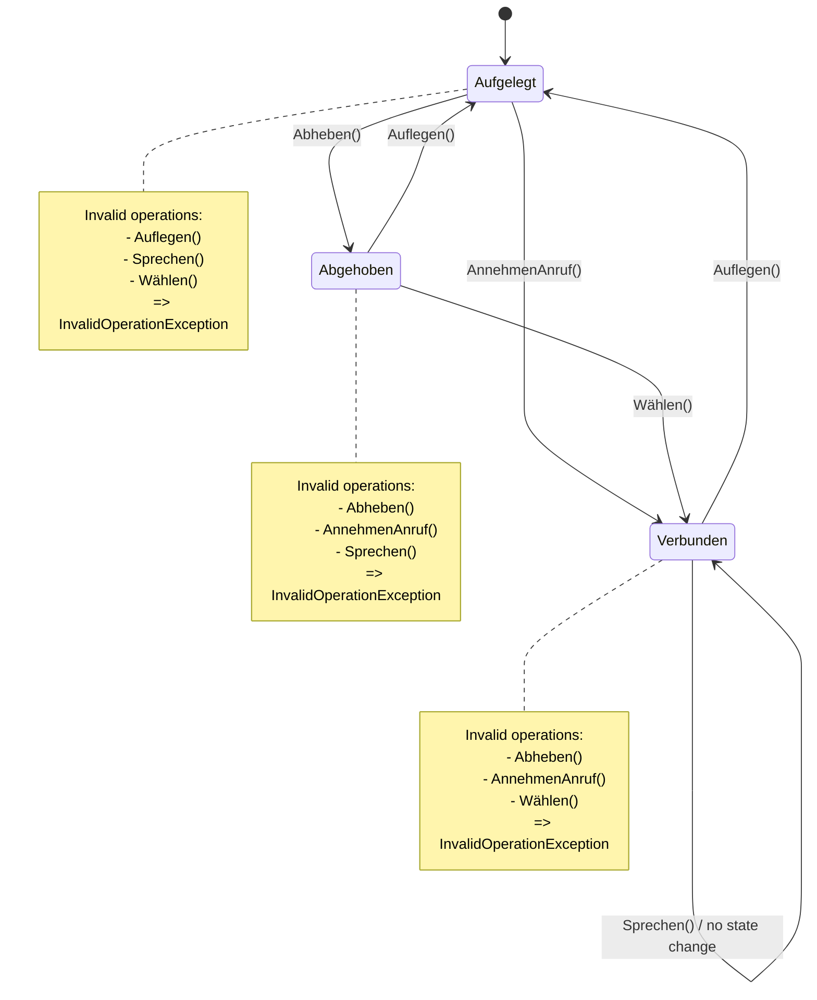

# Telefon State Diagram

State diagram for `Jarai.Refactoring.Telefon.Original.Telefon`.

```mermaid
stateDiagram-v2
	[*] --> Aufgelegt

	Aufgelegt --> Abgehoben : Abheben()
	Aufgelegt --> Verbunden : AnnehmenAnruf()

	Abgehoben --> Verbunden : Wählen()
	Abgehoben --> Aufgelegt : Auflegen()

	Verbunden --> Aufgelegt : Auflegen()
	Verbunden --> Verbunden : Sprechen() / no state change

	note right of Aufgelegt
	  Invalid operations:
	  - Auflegen()
	  - Sprechen()
	  - Wählen()
	  => InvalidOperationException
	end note

	note right of Abgehoben
	  Invalid operations:
	  - Abheben()
	  - AnnehmenAnruf()
	  - Sprechen()
	  => InvalidOperationException
	end note

	note right of Verbunden
	  Invalid operations:
	  - Abheben()
	  - AnnehmenAnruf()
	  - Wählen()
	  => InvalidOperationException
	end note
```
